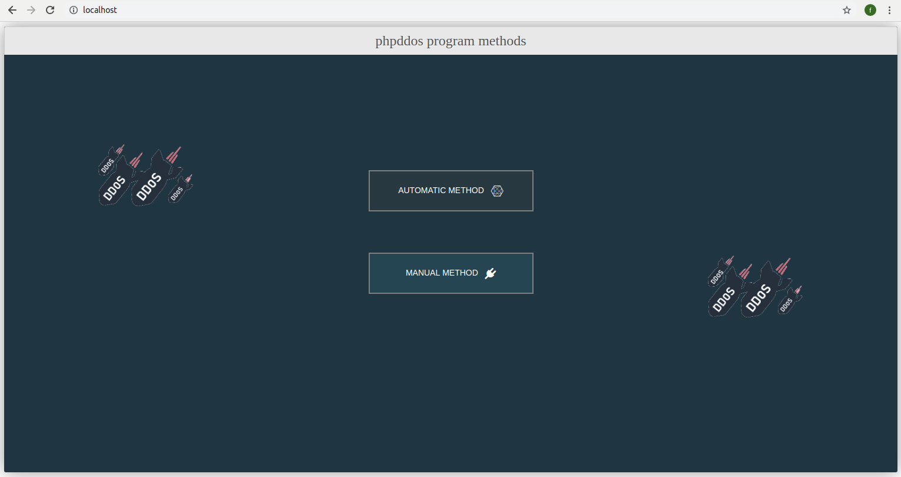
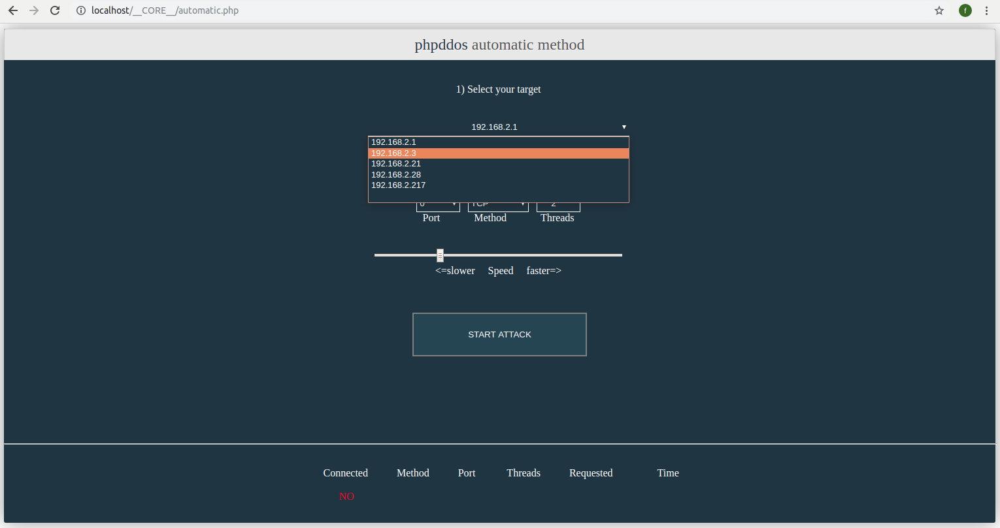
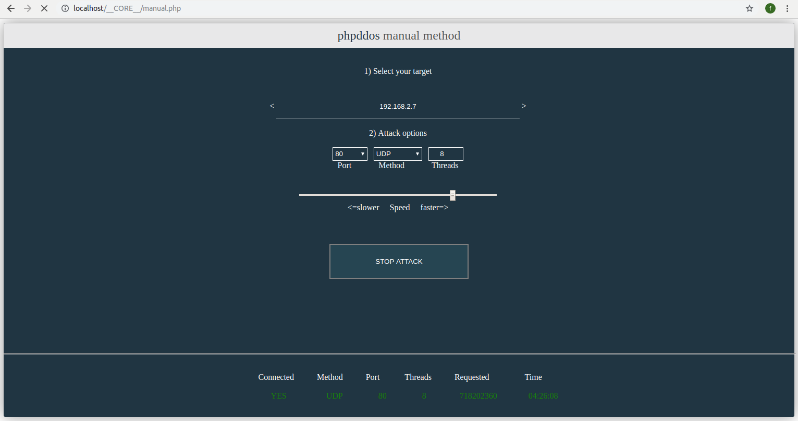

# phpddos
# phpddos-v1.0

1) First disabled log files from apache  

find /etc/apache2/apache2.conf  

for error_log   
and comment  #ErrorLog ${APACHE_LOG_DIR}/error.log  
after added  ErrorLog /dev/null   

for acces log  

sudo a2disconf other-vhosts-access-log  

Restart apache gracefully: 
apache2ctl graceful     

If you want to start a new attack, press stop  

To end all attacks completely restart your server
(The program will not stop sending packages to the destination even tap stop)  

e.g sudo /etc/init.d/apache2 restart   

Attention: if you do not follow the installation instructions properly and you omit to   
comment on errror.log or disable the file other -vhosts-access-log then your hard drive  
will be full and the computer will not be able to load the operating system. 
Because the program is continuously refreshed for packet delivery,  
the errror.log and other-vhosts-log-log files are filled with information.   

       

       

